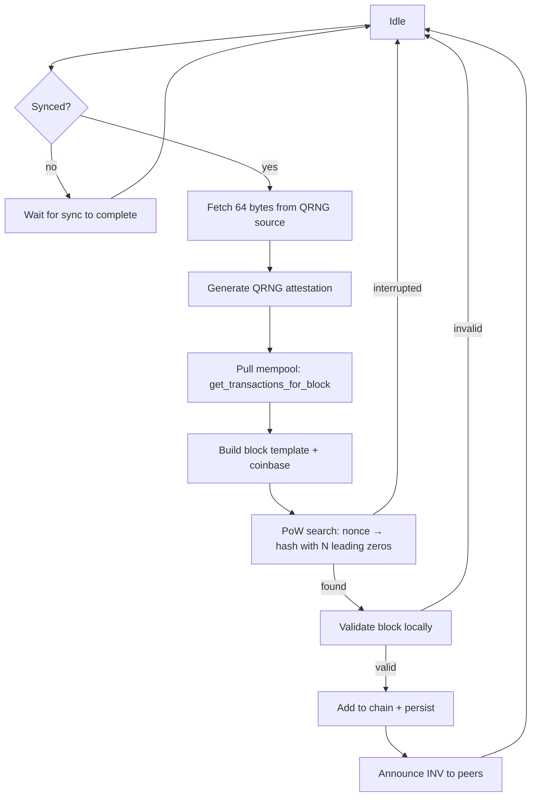

# Mining

## The mining loop

Every mining node runs the same loop in `mining/miner.py`:

Steps in detail:

1. **Sync gate** — if `sync_state == "syncing"`, sleep 5s and loop.
   Don't mine on a stale tip.
2. **Entropy fetch** — `qrng_provider.generate_qrng(num_bits=512)`
   returns ≥ 64 bytes. If it fails or returns insufficient bytes, raise
   — no fallback.
3. **Attestation** — `QRNGAttestation.generate_attestation(...)` builds
   the commitment envelope (see [Entropy](entropy.md)).
4. **Tx selection** — `transaction_pool.get_transactions_for_block()`
   returns up to `MAX_TRANSACTIONS_PER_BLOCK` (100) txs, sorted by
   fee desc + timestamp asc.
5. **Coinbase** — synthesize a `Transaction(sender="mining_reward",
   recipient=miner_address, amount=subsidy+fees, signature="reward_signature")`
   and insert at index 0.
6. **PoW** — iterate `nonce = 0, 1, 2, ...`, hash the block header,
   stop when the hash has `difficulty` leading hex zeros. Runs in an
   executor so the async loop stays responsive.
7. **Local validation** — `validate_received_block(block)`. Must pass.
8. **Add to chain** — `add_validated_block(block)`. Updates balances,
   persists to SQLite, removes confirmed txs from mempool.
9. **Announce** — `propagation.announce_block(block)` — INV message
   to all peers; they respond with GETDATA if interested.

Interruption: if a peer's block arrives at the same height during the
PoW search, the local miner is interrupted via `miner.interrupt()` and
restarts on the new tip.

## Picking a miner address

Every mining node has a wallet that receives the coinbase. Two options:

1. **Auto-create** (default if `miner_address` is unset). The node
   generates a fresh ML-DSA-87 keypair on first boot and stores it in
   the local wallet store. The chain's `wallets` dict gets the new
   wallet attached.

2. **Bring your own**. Set `--miner-address <hex>` or
   `[mining].miner_address` in `config.toml`. The node will refuse to
   start mining if it doesn't have the private key for that address.

For long-running miners, prefer option 2 with a key you control offline.

## Difficulty adjustment

See [Blocks and consensus → Difficulty adjustment](blocks.md#difficulty-adjustment).
Key points:

- Recalculated only at `DIFFICULTY_ADJUSTMENT_INTERVAL`-block boundaries
  (every 10 blocks).
- Bound to `[2, 8]` mainnet, `[2, 4]` testnet.
- Each adjustment is `±1` max — no large jumps.

The testnet cap exists because `performance-1x` Fly VMs can't reasonably
mine past difficulty 4 (block times explode). On bare metal with GPU
or ASIC, mainnet's `[2, 8]` range is appropriate.

## Hardware vs hosted mining

Three credible profiles:

| Setup | Cost | Block time at network difficulty 4 |
|---|---|---|
| `performance-1x` Fly VM (CPU-only Python) | ~$25/mo | ~1-5 sec |
| Bare-metal x86 with rust impl (planned) | $50-200/mo | ms range |
| ASIC (future) | — | ms range |

The reference implementation is **deliberately Python**, for
auditability over speed. A miner that wants competitive economics on
mainnet will use a rewritten PoW search loop.

## What the miner doesn't do

- **Doesn't choose contract execution order.** Tx execution is in
  selection order (fee desc, timestamp asc). No flashbots-style
  reordering markets in v1.
- **Doesn't censor.** The chain has no opinion on which txs miners
  include. Censorship-resistance comes from miner diversity.
- **Doesn't run the QRNG itself.** The miner is a consumer of the
  entropy source, not a producer. If you want to also run the
  source, run [the entropy aggregator](../nodes/entropy.md) as a
  second service.
